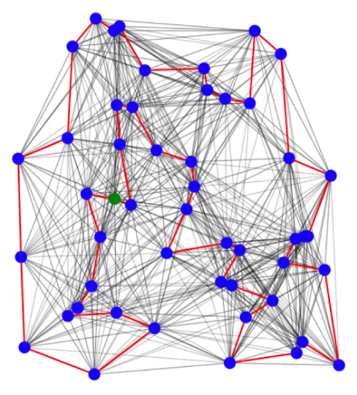
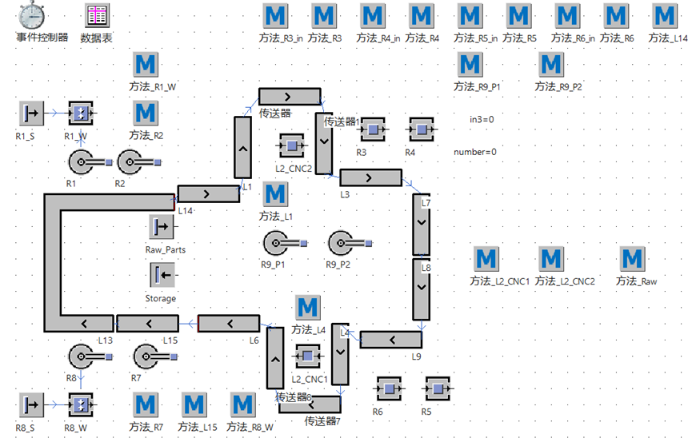
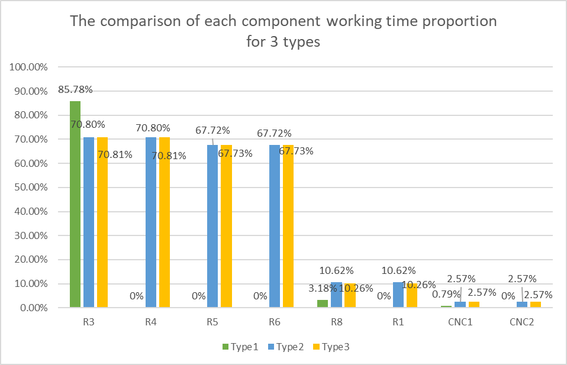

# An Automated Assembly Line for the Luban Lock
This web page is maintained for sharing the project materials in Smart Factory, 2023 spring. Welcome to email us at <202030101256@mail.scut.edu.cn>.

# Project Materials

## Report
[Click here to download the pdf form of our report.](Automated Line/An_Automated_Assembly_Line_for_the_Luban_Lock_SharpShooters.pdf)

## Overview
<figure markdown>
  { width="500" }
  <figcaption>Illustration for Combinatorial Optimization Problem</figcaption>
</figure>  

<figure markdown>
  { width="600" }
  <figcaption>Simulation Model for the Assembly Line</figcaption>
</figure>  

<figure markdown>
  { width="600" }
  <figcaption>Results Comparison Between Three Types Scheduling Plan</figcaption>
</figure>  

<figure markdown>
  { width="600" }
</figure>  
