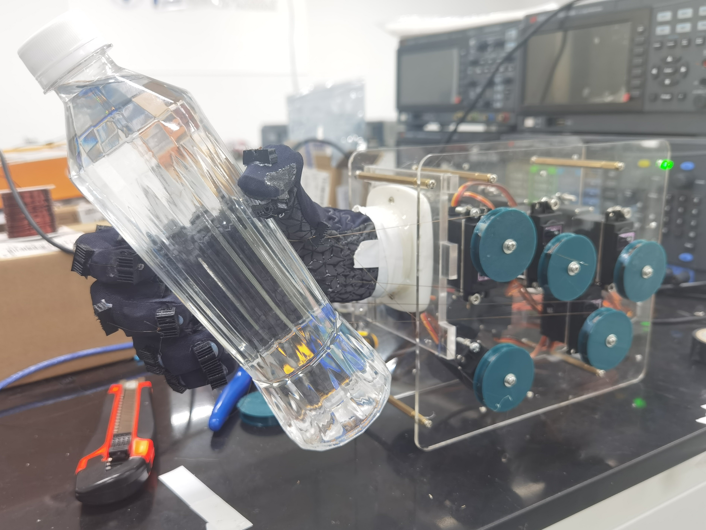
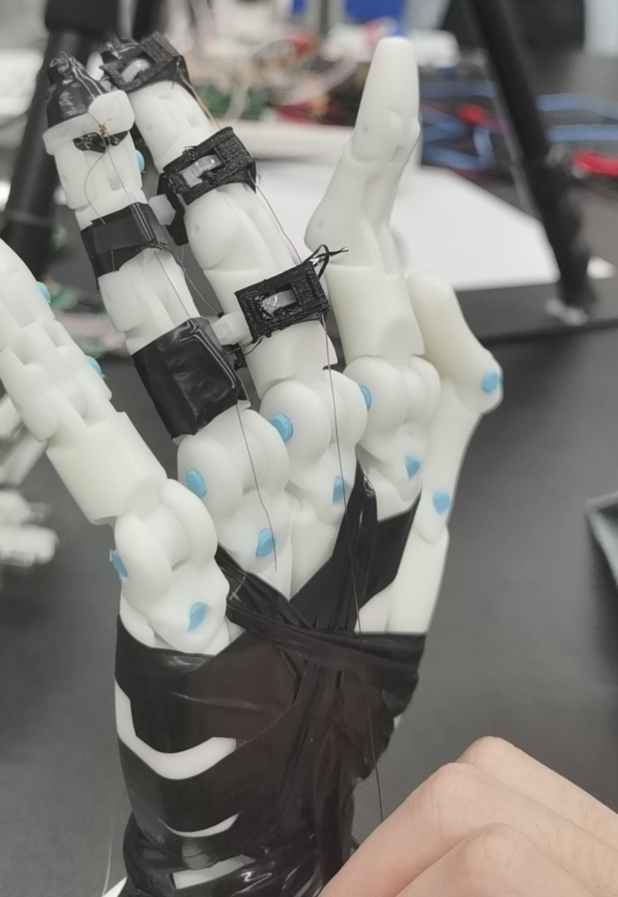
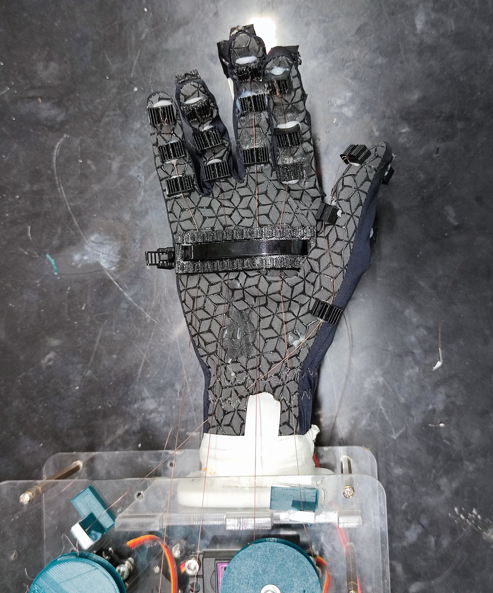
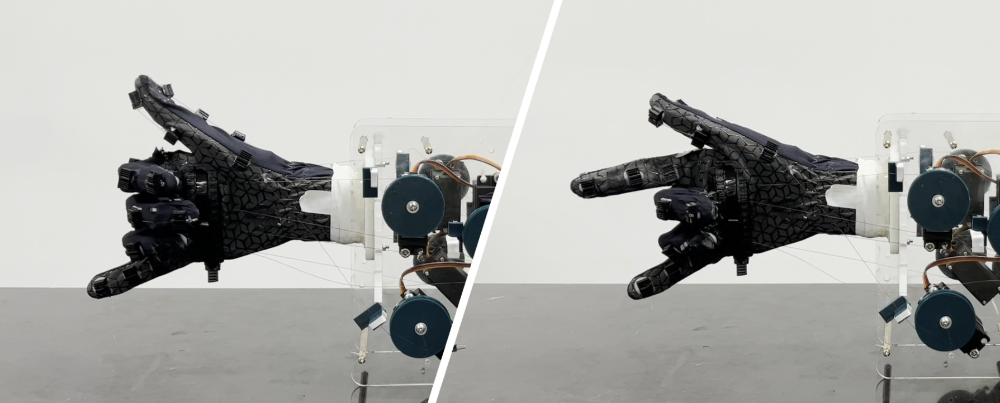
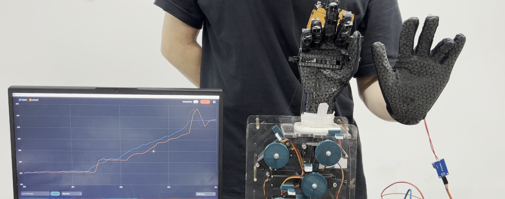
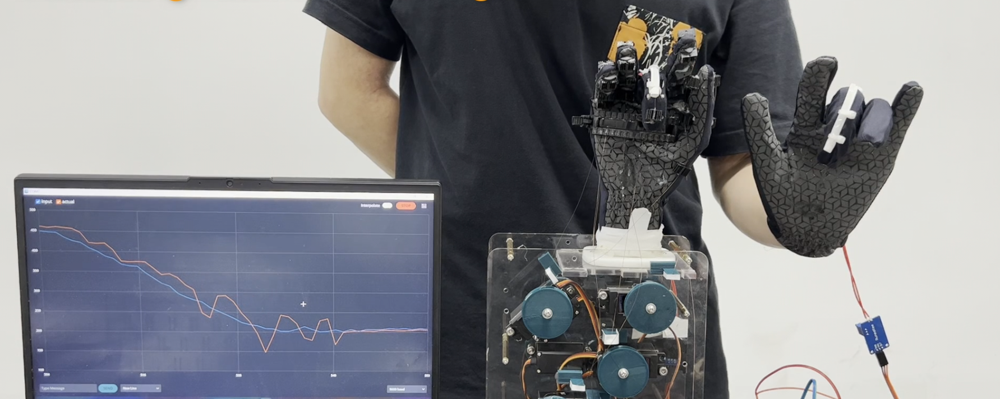

# Tendon-Driven and Flex Sensor Based Gesture Sensing Hand Exoskeleton
This web page is maintained for sharing the project materials in Design and Manufacturing II, 2023 spring. Welcome to email us at <202030101256@mail.scut.edu.cn>.

# Abstract
Hand is one of the most complex and sensitive organs in human body and diseases such as stroke will result in the loss or semi-loss of the hand movement ability. This project aims to design a hand exoskeleton which assists people suffer from hand diseases to rehabilitate and supports their daily requirements on hands. This project can be divided into two parts as actuation system and sensing system. We design the bionic anchors, manufactrue them using 3-D printer and attach them to the glove. These anchors are used to fix the tendons connected to motors. 10 motors are used to fully actuate the hand exoskeleton while each finger is controlled by 2 motors, for fexion and extension respectively. Flex sensors are used to measure the bending extent of each finger and the gesture information of the hand can be reflected by the measurement from 5 flex sensors. Hence, closed-loop gesture control can be achieved, where we use the hand exoskeleton to actuate the hand with disease to mimic the gesture of other healthy hand, which can be used to support the rehabilitation process. Based on the bending extent measurements, we also add safety insurances to avoid harmful gestures.  
***Keywords: mechatronics; tendon-driven; flex sensor; gesture control; hand rehabilitation.***

# Project Materials

## Report
[Click here to download the pdf form of our report](Hand_Exoskeleton/Report_Hand_Exoskeleton_SharpShooters.pdf)

## Video Demo
<iframe src="//player.bilibili.com/player.html?aid=399365953&bvid=BV1eo4y1u7Z5&cid=1148102749&page=1&high_quality=1&danmaku=0" allowfullscreen="allowfullscreen" width="100%" height="450" scrolling="no" frameborder="0" sandbox="allow-top-navigation allow-same-origin allow-forms allow-scripts"></iframe>

Or [click here](https://www.bilibili.com/video/BV1eo4y1u7Z5/?share_source=copy_web&vd_source=6e25c0ee215551350286d8e6cebc616d) to watch the 1080P video in bilibili.

## Overview

<figure markdown>
  { width="500" }
  <figcaption>Final Prototype</figcaption>
</figure>

<figure markdown>
  { width="500" }
  <figcaption>Fake Mechanical Hand</figcaption>
</figure>

<figure markdown>
  { width="500" }
  <figcaption>Bionic Anchors Attached to the Glove</figcaption>
</figure>

<figure markdown>
  { width="500" }
  <figcaption>Flex Sensor Configuration</figcaption>
</figure>

<figure markdown>
  { width="800" }
  <figcaption>Special Gesture With Hand Exoskeleton</figcaption>
</figure>

<figure markdown>
  { width="500" }
  <figcaption>Dynamical Tracking</figcaption>
</figure>

<figure markdown>
  { width="500" }
  <figcaption>Dynamical Tracking</figcaption>
</figure>
